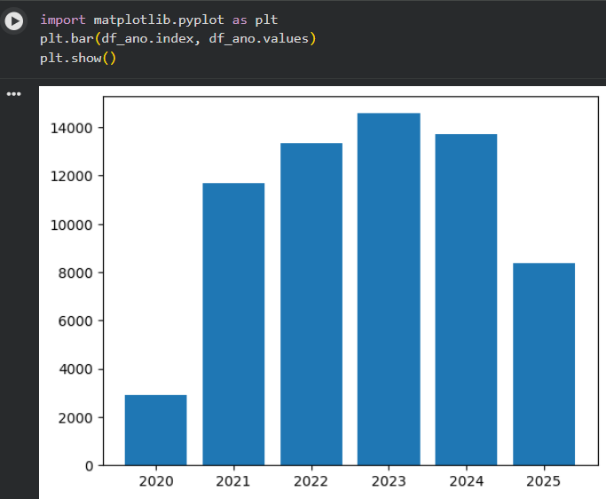
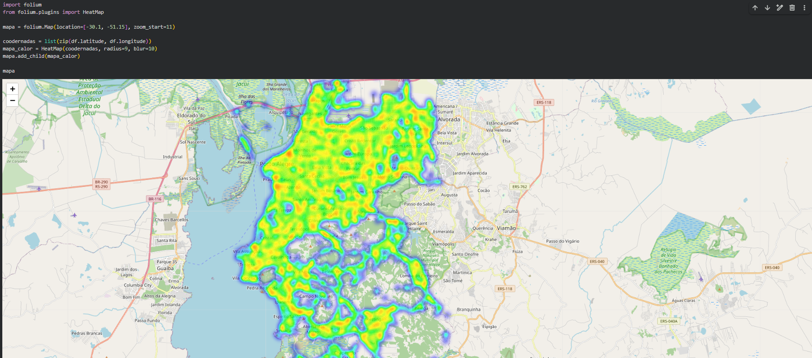
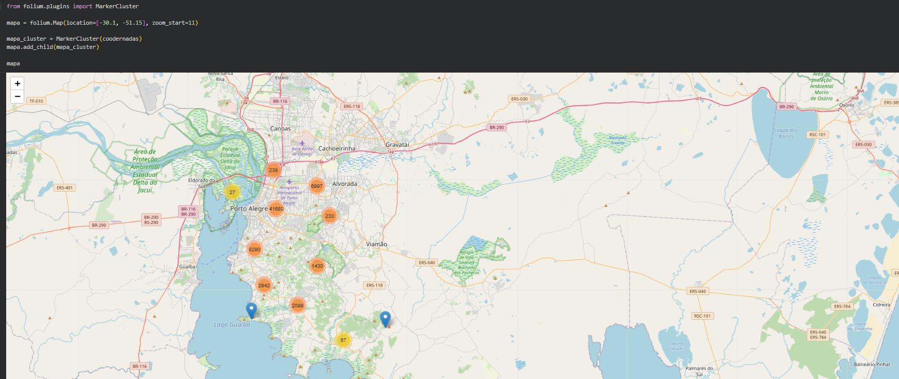

# 🚦 Análise de Acidentes de Trânsito

Projeto de **análise de dados com Python** para identificar padrões e concentrações de acidentes de trânsito por meio de **visualizações estatísticas e análise geográfica**.

---

## 🛠️ Tecnologias Utilizadas

- **Python**
- **Pandas** — manipulação e tratamento de dados
- **Matplotlib** — visualização de dados
- **Folium** — criação de mapas interativos e heatmaps

---

## 📊 Análises Realizadas

O projeto inclui diferentes etapas de análise de dados:

- 🔹 **Limpeza e tratamento dos dados**
- 🔹 **Análise exploratória (EDA)**
- 🔹 **Criação de heatmap geográfico** para identificar regiões com maior concentração de acidentes
- 🔹 **Clusterização** para detectar agrupamentos de ocorrências
- 🔹 **Visualizações com Matplotlib** para análise estatística

---

## 🗺️ Exemplo de Visualização

Mapa de calor demonstrando áreas com maior concentração de acidentes.

*(adicione aqui a imagem do seu mapa ou gráfico)*

---

## 🎯 Objetivo

Explorar dados de acidentes de trânsito para **identificar padrões espaciais e estatísticos**, auxiliando na compreensão de **áreas com maior risco** e contribuindo para análises que podem apoiar decisões relacionadas à mobilidade urbana e segurança no trânsito.

---

## 📁 Estrutura do Projeto
python-analise-acidentes-floripa/

### Gráfico estatístico

### Mapa de Calor

### Cluster de Acidentes

